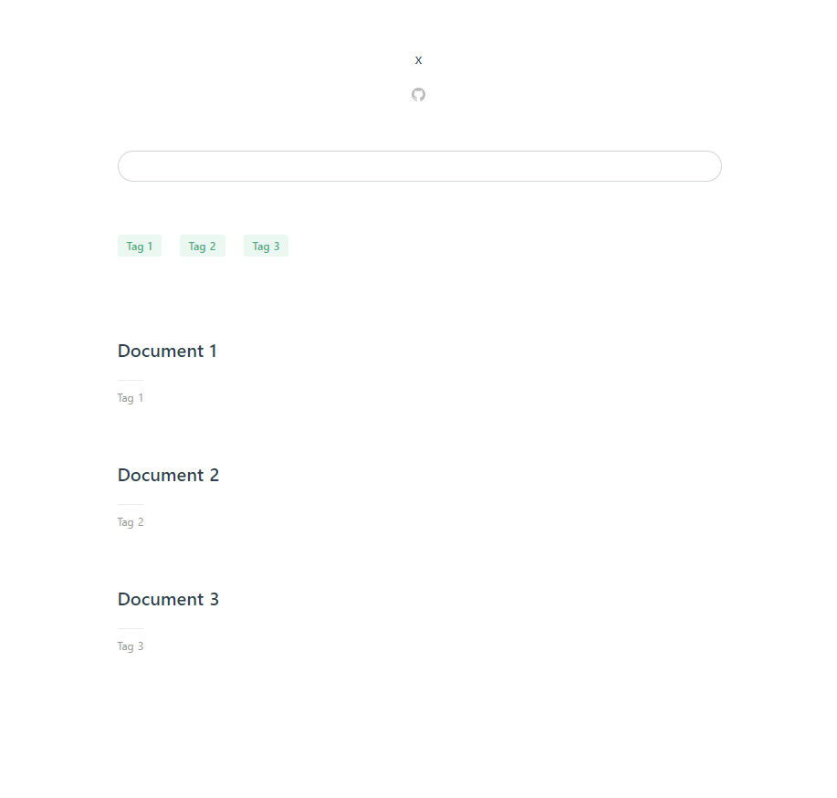

# vuepress-theme-x

VuePress theme.

[Preview](https://h69.github.io)

[](https://www.npmjs.com/package/vuepress-theme-x)

## Installing

```
npm install vuepress-theme-x
```

## Usage

```JavaScript
// config.js
module.exports = {
  theme: 'x'
}
```

## Examples

```
.
└── docs
    ├── .vuepress
    |   └── config.js
    ├── Tag 1
    |   └── Document 1
    |       └── README.md
    ├── Tag 2
    |   └── Document 2
    |       └── README.md
    ├── Tag 3
    |   └── Document 3
    |       └── README.md
    └── README.md
```

```JavaScript
// config.js
module.exports = {
  title: 'x',
  theme: 'x',
  themeConfig: {
    editLinkText: 'Edit',
    editLinks: true,
    repo: 'username/repo',
    search: true,
    searchMaxSuggestions: -1,
    nav: [
      {
        text: 'github',
        link: 'https://github.com',
      },
    ],
    sidebar: {
      '/': [
        {
          title: 'Tag 1',
          children: [
            '/Tag 1/Document 1/',
          ],
        },
        {
          title: 'Tag 2',
          children: [
            '/Tag 2/Document 2/',
          ],
        },
        {
          title: 'Tag 3',
          children: [
            '/Tag 3/Document 3/',
          ],
        },
      ],
    },
  },
}
```


